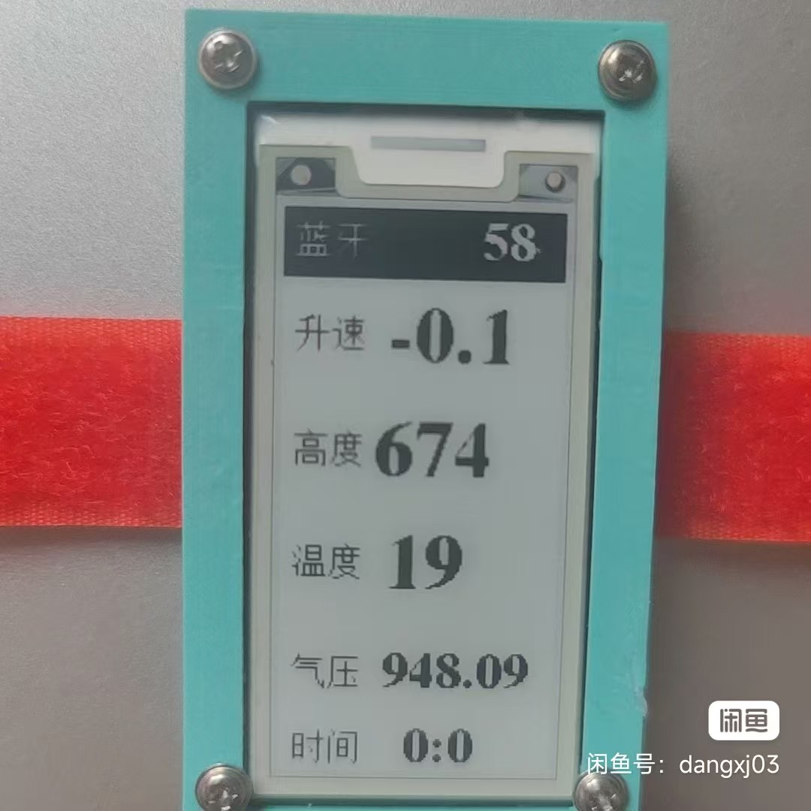
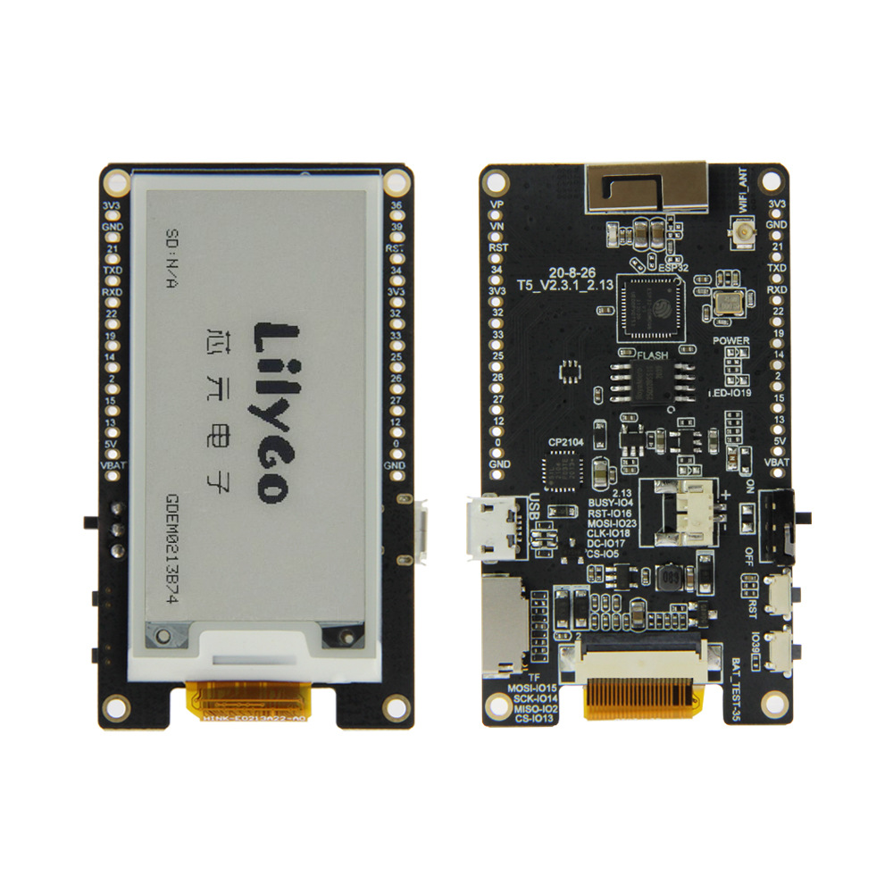
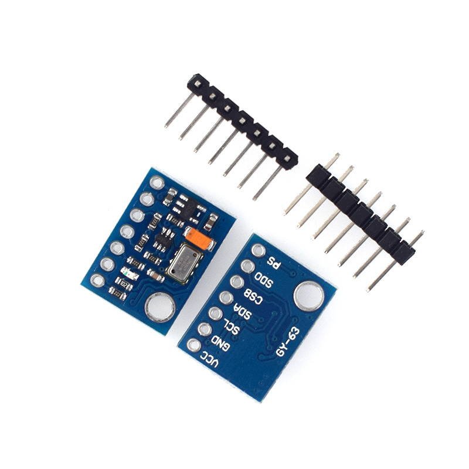
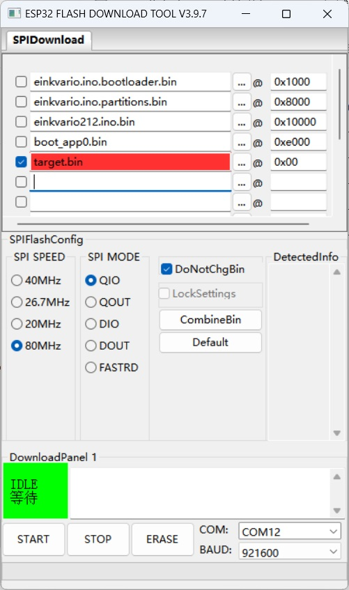

# eink_vario
 eink_vario  
墨水屏高度表  
滑翔伞用  
  

特色  
墨水屏阳光下显示方便看  
ms5611气压计灵敏，盘气流响应快  
支持蓝牙连xctrack当外置气压计  
体积小巧，绑手腕或组带都方便  
有蜂鸣器，不过还是连xc时声音更好  

参数  
屏幕2.13寸  
屏幕2秒刷新，气压数据和蓝牙传输每秒10次  
电池750mah，用一天够。  
连蓝牙时费电些。  

硬件及购买信息(万能淘宝搜索)：  
开发板：Lilygo T5 2.13寸  
气压计：GY-63 MS5611-01BA03  
蜂鸣器：无源分体带线，3V，16欧，12*8.5mm  
3D打印外壳  
3.7V锂电池：603040或803040，1.25正向插头  
魔术捆扎带：宽度2cm  
以上硬件网购约200元。

另GPS版本：双模GPS模块:ATGM336H  

软件：  
采用arduino+esp开发  

硬件连接：  
  
  
气压计连接：  
气压计-->开发板  
VCC-->3V3  
GND-->GND  
SCL-->22  
SDA-->21  
其余不接。
蜂鸣器连接：  
两脚分别连接12和GND  

固件上传:
两种方法  
方法1：  
用arduino配置好esp环境，下载好程序乃至的库，选择esp dev module,一键编译+上传  
方法2：  
用esp32 flash_download_tool直接烧写编译好的程序  
工具无法上传，需要自己下载。
上传可选择一个合并固件target.bin或者多个独立分区固件两种上传方式。  
两种方式都可以，对应地址按图填写。  
固件文件夹为GxEPD2_213_B73对应固件，如果开发板型号为其它类型，则需要按方法1自行编译，
或者微信联系dangxj03  

